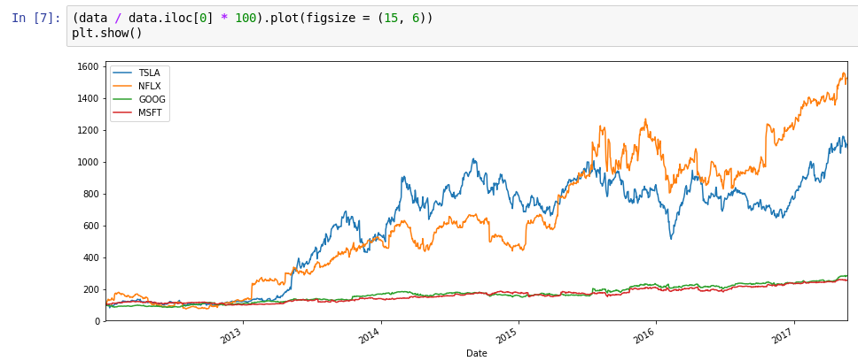

# Python for finance

Notebooks and analisys using Python for studying finance.

Jupyter notebooks explaining basic mathematical finance concepts

### Python for Finance: Investment Fundamentals & Data Analytics 

## Contact
You can send me a note on Linkedin [@alardosa](https://www.linkedin.com/in/alardosa/)

or visit my website at:

[www.alardosa.com](https://www.alardosa.com)
